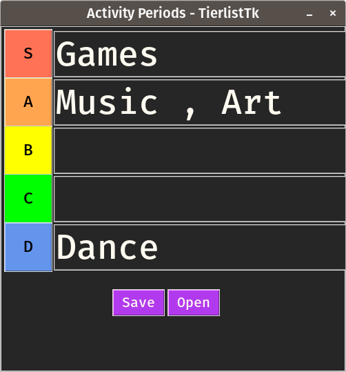

# TierlistTK
A remake of TierMaker on python tkinter which is cross platform and lightweight

# Features:-

- Supports saving
- Handles error when exception occurs
- File Detection with tierlist
- Beautiful yet minimal UI
- Keyboard shortcuts
- Light/Dark Mode

# Keybindings:-

- Ctrl + O = Open a tierlist
- Ctrl + S = Save a tierlist

# Requirements

- Python 3.6 or above with a Tcl/Tk install..
- Fira Mono Font

# Screenshots:-

